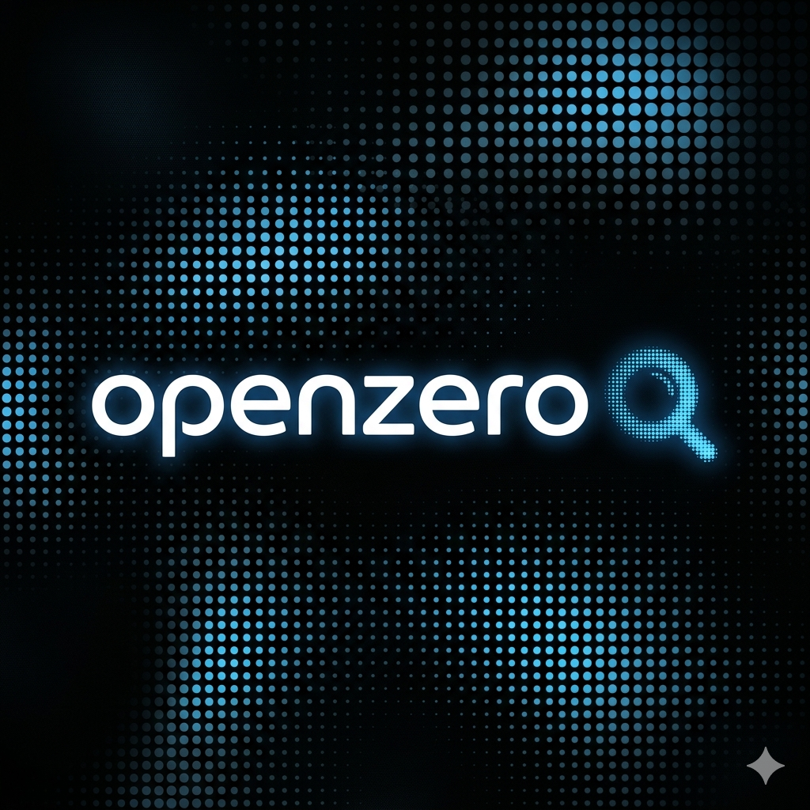

# OpenZero

<p align="center">
  
</p>

OpenZero is a modular research and development assistant Discord bot. It combines advanced AI reasoning with Open Data sources to provide a powerful tool for researchers, developers, and server administrators.

## Core Features

- **AI-Powered Tutorial Search (`!tutorial`)**: Uses a fallback AI system (Gemini, Groq, OpenRouter) to recursively scan repositories and find relevant documentation.
- **Multilingual Support (`!language`)**: Supports 31 languages with **AI-powered automatic language detection** from user inputs.
- **Research Tools**:
  - **arXiv (`!arxiv`)**: Access scientific papers in real-time.
  - **Wikipedia (`!wikipedia`)**: article article article summaries.
  - **Open Library (`!openlibrary`)**: Search and browse millions of books.
  - **Product Search (`!product`)**: Find product recommendations with estimated prices using AI.
  - **Developer Tools**:
  - **Nerd Fonts (`!nerdfont`)**: Find and download patched fonts for your IDE.
- **Server Management**:
  - **Moderation**: Dedicated tools for **!kick**, **!ban**, **!clear**, and **!info**.
  - **Ticket System (`!ticket`)**: Persistent private support tickets with **MongoDB** integration and automated 1-week expiry.
  - **Purge (`!purge`)**: Efficient bulk message deletion.

## Technology Stack

- **Runtime:** Node.js v18+ (ES Modules)
- **Framework:** Discord.js v14
- **Backend API:** Flask (Python) for intensive data fetching.
- **Database:** MongoDB (for persistent tickets and settings).
- **AI Integration:** Multi-provider rotation (Gemini 2.0/2.5, Llama 3.3/4, Qwen, etc.).
- **Localization:** Custom i18n system integrated with **Crowdin**.

## Installation

1. Clone the repository.
2. Create a `.env` file based on `.env.example`.
3. Fill in the required tokens:
   - `DISCORD_TOKEN`, `CLIENT_ID`, `GITHUB_TOKEN`
   - `GEMINI_API_KEY`, `GROQ_API_KEY`, `OPENROUTER_API_KEY`
   - `MONGODB_URI` (e.g., `mongodb://localhost:27017/openzero`)
   - `API_URL` (Your Flask API endpoint)
   - `APP_MODE` (`production` or `dev`)
4. Install dependencies:
   ```bash
   npm install
   ```
5. Register Slash Commands (Mandatory):
   ```bash
   npm run deploy
   ```

## Railway Deployment

OpenZero is designed for easy deployment on **Railway**.
- **Commands Registration:** During the build phase, `npm run build` will automatically register your slash commands if `CLIENT_ID` and `DISCORD_TOKEN` are set.
- **Worker Process:** The `Procfile` is configured to run the bot as a background worker.
- **Environment Variables:** Ensure all keys from `.env.example` are added to your Railway project settings.

The bot includes a **Dev Mode**. When `APP_MODE=dev` is set, the bot only responds in channels named "dev", "debug", or "test" to prevent interference with live servers.

---
*Help us translate OpenZero at [Crowdin](https://crowdin.com/project/openzero)*
